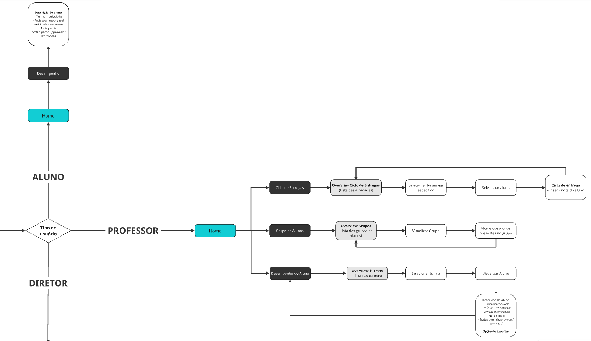
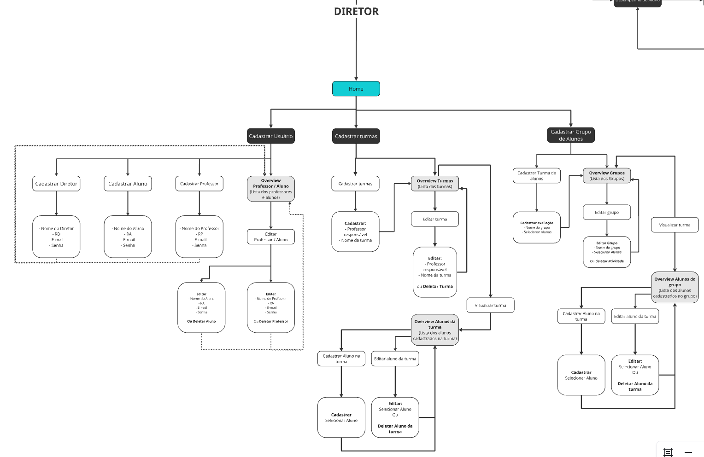
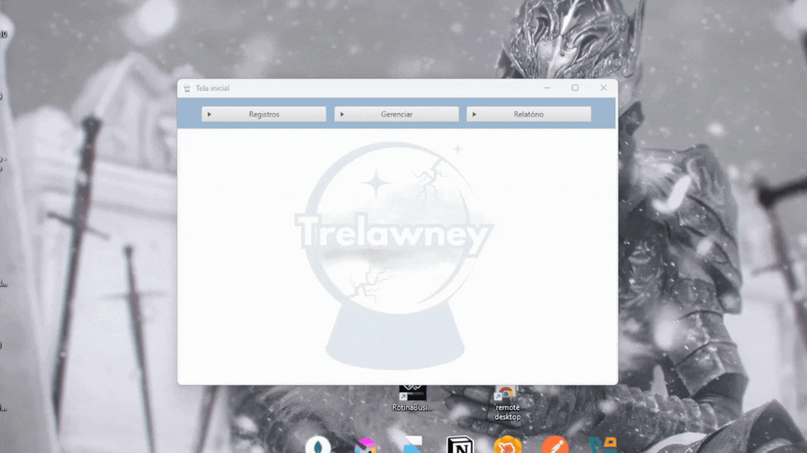
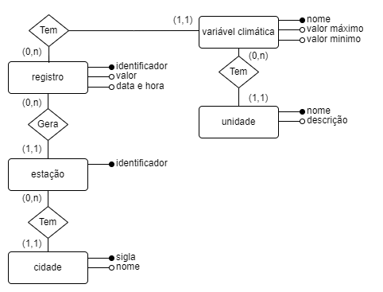
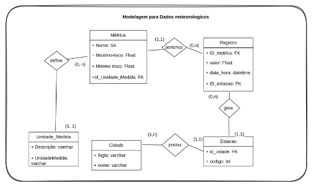
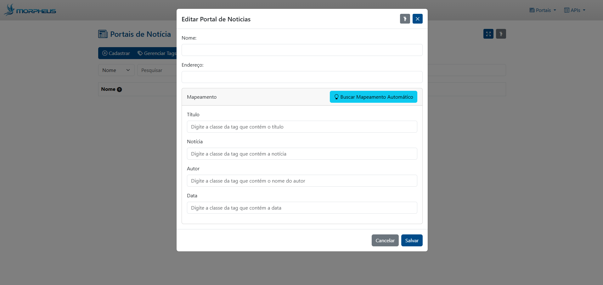
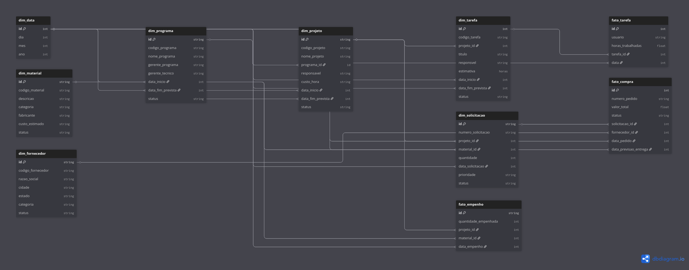

# Elbert Jean dos Santos

## Introdução

Este portfólio acadêmico reúne os projetos desenvolvidos ao longo da minha formação em Tecnologia em Banco de Dados pela [Faculdade de Tecnologia de São José dos Campos - Prof. Jessen Vidal](https://fatecsjc-prd.azurewebsites.net/).

Iniciei o curso em 2023 e, paralelamente à formação acadêmica, passei a atuar profissionalmente na área de tecnologia, ingressando na SpotSat e posteriormente assumindo a posição de Desenvolvedor Front-End. Essa experiência simultânea entre faculdade e mercado teve um papel importante na minha formação: enquanto profissionalmente aprofundei meus conhecimentos em desenvolvimento de interfaces, integração com APIs, visualização de dados e aplicações web, na Fatec ampliei minha experiência com banco de dados, desenvolvimento backend, modelagem de sistemas e processamento de dados.

A trajetória passou por fundamentos de desenvolvimento web, processamento de dados geoespaciais, pipelines ETL, autenticação e conformidade com a LGPD, até a entrega de sistemas distribuídos com arquitetura de banco de dados dual. Em paralelo ao desenvolvimento técnico, conduzi equipes em ambientes de alta pressão, lidando com conflitos interpessoais, recomposições de time e acúmulo de funções, experiências que moldaram minha visão sobre liderança e entrega de valor.

A combinação entre a formação em Banco de Dados e a experiência profissional em desenvolvimento Front-End contribuiu para uma visão mais completa sobre desenvolvimento de software, permitindo compreender e atuar no ciclo completo de criação de sistemas — desde a análise do problema e estruturação da solução, passando pelo desenvolvimento, modelagem de dados e integração de serviços, até aspectos de segurança, deploy e manutenção. Essa vivência aproximou áreas que inicialmente estudava de forma separada e consolidou meu interesse por arquitetura de sistemas, desenvolvimento Full Stack e construção de soluções orientadas a dados.

## Meus Projetos

## :heavy_check_mark: 1º Semestre - 2023-2

### Parceiro Acadêmico
[Faculdade de Tecnologia de São José dos Campos - Prof. Jessen Vidal](https://fatecsjc-prd.azurewebsites.net/)

Fatec São José dos Campos - Prof. Jessen Vidal

<b>Figura 1: Fachada da Fatec SJC</b>

No primeiro semestre, em parceria com a própria Fatec São José dos Campos, foi proposto o desenvolvimento de uma solução para auxiliar no gerenciamento dos ciclos de avaliação utilizados pela instituição. O desafio estava relacionado ao acompanhamento dos scores dos alunos e ao cálculo do FEE (Fator de Ensino Evolutivo), buscando centralizar e organizar informações que faziam parte desse processo.

O [TimeMorize](https://github.com/ElbertJean/API-1) desenvolveu uma aplicação web voltada à gestão desses ciclos de avaliação, permitindo o gerenciamento de turmas, grupos, alunos, professores e atividades, além do lançamento e acompanhamento dos scores e da exportação dos dados consolidados.

O projeto foi desenvolvido utilizando Python e Flask e, por se tratar do primeiro semestre do curso, um dos requisitos era trabalhar a persistência de dados sem a utilização de bancos de dados SQL ou NoSQL. Dessa forma, o sistema utilizou arquivos como JSON para armazenamento das informações, proporcionando os primeiros contatos com desenvolvimento web, organização de dados e construção de uma aplicação a partir de requisitos apresentados por um cliente.

Visão geral do projeto

<b>Figura 2: Visão geral, passando por todas as sessões do projeto</b>

A persistência dos dados foi implementada utilizando arquivos JSON, sem o uso de um sistema gerenciador de banco de dados, conforme os requisitos estabelecidos para o primeiro semestre. As informações eram carregadas e manipuladas pela aplicação em Python com Flask, permitindo o gerenciamento dos dados relacionados a alunos, turmas, grupos, atividades e ciclos de avaliação.

A partir dos dados registrados, o sistema realizava o processamento das avaliações e dos scores dos alunos, possibilitando o acompanhamento dos resultados de cada ciclo e a consolidação das informações utilizadas no processo de avaliação.

Antes do início do desenvolvimento, foi elaborado um fluxograma para representar o comportamento esperado da aplicação e organizar os diferentes fluxos de navegação de acordo com o perfil do usuário. O diagrama definiu as principais funcionalidades disponíveis para alunos, professores e diretores, servindo como referência para a implementação das telas e regras do sistema.

Fluxograma de Funcionamento do Sistema

<b>Figura 3 e 4: Fluxograma de funcionamento e navegação do sistema TimeMorize</b>

### Tecnologias utilizadas

- **HTML5 / CSS3:** Utilizados na estruturação e estilização das páginas da aplicação, definindo a organização visual e a apresentação das diferentes funcionalidades do sistema.
- **Python:** Linguagem utilizada no desenvolvimento da lógica do backend, responsável pelo processamento das informações e pelas regras de negócio da aplicação.
- **Flask:** Framework utilizado para construção do backend da aplicação, realizando o roteamento das páginas, processamento das requisições e integração entre a interface e os dados do sistema.
- **JSON:** Utilizado para persistência dos dados da aplicação, permitindo o armazenamento das informações sem a utilização de um sistema gerenciador de banco de dados, conforme os requisitos definidos para o primeiro semestre.
- **Bootstrap:** Framework utilizado para auxiliar na construção e estilização das interfaces, proporcionando componentes reutilizáveis e responsividade às páginas.
- **jQuery:** Utilizado para manipulação de elementos da interface e implementação de comportamentos dinâmicos no frontend.
- **Axios:** Utilizado para realizar requisições HTTP entre o frontend e os endpoints disponibilizados pelo backend.
- **Figma:** Utilizado no planejamento e prototipação das interfaces da aplicação antes da implementação.
- **Miro:** Utilizado para elaboração do mapeamento dos fluxos da aplicação, definindo a navegação, funcionalidades e comportamentos esperados para cada perfil de usuário.
- **Git / GitHub:** Utilizados para versionamento do código-fonte, organização do repositório e colaboração entre os integrantes da equipe durante o desenvolvimento.

### Contribuições Pessoais

Atuei como Product Owner durante o projeto, o que me colocou diretamente no processo de entendimento do problema apresentado pela Fatec. Antes de pensar na implementação, precisei compreender como os diferentes perfis utilizariam o sistema e transformar os requisitos apresentados pelos professores em um fluxo de funcionamento claro para a equipe. A partir disso, desenvolvi o fluxograma completo da aplicação, posteriormente validado com os professores, além do wireframe e da proposta visual que serviram como referência para o desenvolvimento das telas.

Durante a implementação, também participei diretamente do desenvolvimento da aplicação, contribuindo na construção e padronização das interfaces e na organização da estrutura utilizada para persistência dos dados em JSON. Foi meu primeiro contato acadêmico com a necessidade de pensar não apenas na tela, mas também em como as informações seriam estruturadas, relacionadas e utilizadas pelo restante do sistema.

Além do desenvolvimento, tive participação significativa na documentação do projeto, organizando informações sobre o funcionamento da aplicação, requisitos, funcionalidades e entregas realizadas durante as sprints. Por atuar simultaneamente entre produto, documentação e desenvolvimento, esse primeiro semestre foi importante para começar a compreender o software como um conjunto: entender o problema, planejar a solução, documentá-la e, por fim, participar da sua implementação.

### Hard Skills

- Estruturação e estilização de páginas com HTML5, CSS3 e Bootstrap: **Sei fazer com autonomia**;
- Lógica de programação com Python: **Sei fazer com ajuda**;
- Desenvolvimento de aplicações web e rotas utilizando Flask: **Sei fazer com ajuda**;
- Manipulação e estruturação de dados em arquivos JSON: **Sei fazer com autonomia**;
- Integração entre frontend e backend através de requisições HTTP: **Sei fazer com ajuda**;
- Prototipação e criação de wireframes utilizando Figma: **Sei fazer com autonomia**;
- Modelagem de fluxos de navegação e funcionalidades utilizando Miro: **Sei fazer com autonomia**;
- Versionamento de código com Git e GitHub: **Sei fazer com ajuda**;
- Levantamento, organização e documentação de requisitos: **Sei fazer com ajuda**;
- Organização de backlog e aplicação de práticas Scrum no papel de Product Owner: **Sei fazer com ajuda**.

### Soft Skills

O primeiro semestre também representou meu primeiro contato real com o desenvolvimento de um projeto em equipe. Precisei aprender a trabalhar com pessoas com diferentes opiniões, formas de comunicação e níveis de comprometimento, conciliando ideias e responsabilidades enquanto lidávamos com prazos de sprint e entregas acadêmicas.

Por atuar como Product Owner, parte desse desafio passou também pela organização do grupo e pelo acompanhamento das entregas. Nem todos os integrantes apresentaram o mesmo nível de comprometimento com o projeto e, ao final da segunda sprint, foi necessário tomar a decisão de retirar três integrantes da equipe devido à recorrência de problemas relacionados à participação, responsabilidade com as atividades e comportamento dentro do grupo. Foi uma decisão difícil, principalmente por ser meu primeiro contato com uma situação desse tipo, mas necessária para evitar que a falta de comprometimento de alguns integrantes continuasse prejudicando o trabalho dos demais.

Essa experiência me ensinou que trabalhar em equipe vai muito além de dividir tarefas. Comecei a desenvolver habilidades de **comunicação**, **gestão de conflitos**, **tomada de decisão**, **responsabilidade**, **organização de prazos** e **liderança**, além de entender a importância de estabelecer expectativas claras e acompanhar o comprometimento de cada integrante. Foi também meu primeiro contato com a necessidade de tomar decisões desconfortáveis pensando no resultado coletivo e na continuidade do projeto.

---

## :heavy_check_mark: 2º Semestre - 2024-1

### Parceiro Acadêmico
[Faculdade de Tecnologia de São José dos Campos - Prof. Jessen Vidal](https://fatecsjc-prd.azurewebsites.net/)

No segundo semestre, novamente em parceria com a Fatec São José dos Campos, foi proposto o desenvolvimento de uma solução para o gerenciamento e análise de dados meteorológicos provenientes de estações localizadas no estado de São Paulo. O desafio estava relacionado à existência de múltiplos arquivos CSV, provenientes de diferentes estações e com diferentes formatos, tornando necessário validar, organizar e armazenar essas informações de maneira estruturada.

A [Equipe Javali](https://github.com/ElbertJean/API-2-semestre) desenvolveu uma aplicação desktop em Java capaz de realizar a leitura e validação desses arquivos, armazenar os registros em um banco de dados relacional e disponibilizar relatórios para análise das variáveis climáticas. O sistema também permitia o gerenciamento de cidades, estações e unidades de medida, além da identificação e tratamento de medições consideradas suspeitas.

Este projeto representou uma evolução importante em relação ao primeiro semestre, principalmente pela introdução da modelagem e persistência em banco de dados relacional. Durante o desenvolvimento, tivemos contato com Java, JDBC, modelagem de entidades e relacionamentos, processamento de arquivos CSV e construção de consultas para geração de relatórios, começando a trabalhar de forma mais estruturada com a relação entre aplicação e banco de dados.

Visão geral da aplicação

<b>Figura 5: Visão geral do funcionamento da aplicação</b>

 

Diferentemente do primeiro semestre, neste projeto a persistência passou a ser realizada em um banco de dados relacional. Para estruturar os dados meteorológicos e seus relacionamentos, foram desenvolvidos os modelos conceitual e lógico do banco de dados, representando entidades como cidades, estações, registros, variáveis climáticas e unidades de medida.

Modelagem de Dados

<h4>Modelo Conceitual</h4>

<b>Figura 5: Modelo Entidade-Relacionamento dos dados meteorológicos</b>

  

<h4>Modelo Lógico</h4>

<b>Figura 6: Modelo lógico do banco de dados da aplicação</b>

 

A aplicação permite importar e validar arquivos CSV contendo dados meteorológicos, armazenando as informações em um banco de dados relacional. O sistema disponibiliza o gerenciamento de cidades, estações e unidades de medida, além da geração de relatórios das variáveis climáticas e do tratamento de registros considerados suspeitos a partir dos limites configurados para cada medição.

### Tecnologias Utilizadas

- **Java:** Linguagem principal utilizada no desenvolvimento da aplicação, responsável pela implementação das regras de negócio, processamento dos arquivos CSV e comunicação com o banco de dados.
- **JavaFX:** Framework utilizado para construção da interface gráfica desktop da aplicação, permitindo o desenvolvimento das telas e componentes utilizados pelo usuário.
- **Scene Builder:** Ferramenta utilizada em conjunto com o JavaFX para criação e organização visual das interfaces da aplicação.
- **PostgreSQL:** Sistema gerenciador de banco de dados relacional utilizado para persistência dos dados meteorológicos, armazenando informações de cidades, estações, variaveis climáticas, unidades de medida e registros coletados.
- **JDBC:** Utilizado para realizar a comunicação entre a aplicação Java e o banco de dados PostgreSQL, permitindo consultas, inserções, atualizações e demais operações de persistência.
- **Maven:** Ferramenta utilizada para gerenciamento das dependências e organização do projeto Java, facilitando a configuração e execução da aplicação.
- **Docker:** Utilizado para criação e padronização do ambiente necessário para execução dos serviços utilizados pelo projeto, principalmente do banco de dados.
- **Git / GitHub:** Utilizados para versionamento do código-fonte, organização do repositório e colaboração entre os integrantes da equipe durante as sprints.

### Contribuições Pessoais

Durante o segundo semestre, concentrei minha atuação principalmente no desenvolvimento das interfaces da aplicação e na integração dessas telas com as funcionalidades implementadas em Java. Trabalhei com JavaFX e FXML na construção da tela principal do sistema e de seus fluxos de navegação, conectando as diferentes funcionalidades desenvolvidas pela equipe.

Uma das minhas principais contribuições foi o desenvolvimento do fluxo do relatório BoxPlot. Participei desde a criação das interfaces até a implementação dos controllers responsáveis pela seleção de cidade, estação e período para geração do relatório. Para integrar essa funcionalidade aos dados da aplicação, também implementei consultas ao banco de dados para carregar as cidades cadastradas e suas respectivas estações.

Além disso, contribuí com ajustes no relatório de valor médio e com a integração entre as interfaces e a camada de dados da aplicação. Esse semestre foi meu primeiro contato mais aprofundado com Java, JavaFX, JDBC e banco de dados relacional, exigindo que eu entendesse não apenas como construir uma interface, mas como fazer com que ela consultasse, processasse e apresentasse informações persistidas no PostgreSQL.

### Hard Skills

- Desenvolvimento de aplicações desktop com Java e JavaFX: **Sei fazer com ajuda**;
- Criação de interfaces com Scene Builder e FXML: **Sei fazer com autonomia**;
- Integração com banco de dados PostgreSQL utilizando JDBC: **Sei fazer com ajuda**;
- Operações CRUD e consultas em banco de dados relacional: **Sei fazer com ajuda**;
- Arquitetura em camadas: **Sei fazer com ajuda**;
- Metodologia Ágil Scrum: **Sei fazer com ajuda**.

### Soft Skills

O segundo semestre trouxe um tipo de desafio diferente do primeiro, pois foi quando passei a atuar de forma mais direta no desenvolvimento da API. A equipe precisou lidar com uma stack praticamente nova, utilizando Java, JavaFX, JDBC e banco de dados relacional, além de conceitos como CRUD e arquitetura em camadas, que até então ainda não faziam parte da minha experiência.

Esse cenário exigiu bastante **adaptação** e **aprendizado contínuo**, principalmente por precisar absorver novas tecnologias ao mesmo tempo em que as entregas das sprints continuavam acontecendo. Foi necessário aprender a lidar melhor com **prazos**, organizar as atividades e buscar soluções mesmo quando ainda não dominava completamente as ferramentas utilizadas.

Também desenvolvi mais minha **colaboração em equipe**, já que muitas das funcionalidades dependiam diretamente do trabalho de outros integrantes. Construir uma tela, integrar dados e finalizar uma entrega exigia comunicação constante para entender o que já havia sido desenvolvido e como cada parte deveria se conectar.

Foi um semestre importante para desenvolver **resiliência**, **responsabilidade com entregas** e maior segurança para enfrentar tecnologias desconhecidas. Uma situação em que precisei exercitar a resiliência foi durante o desenvolvimento do relatório BoxPlot: enfrentei dificuldades para integrar a interface em JavaFX com as consultas ao banco de dados utilizando JDBC. Como as ferramentas eram novas para mim, as primeiras tentativas de carregar as informações na tela resultaram em erros. Em vez de repassar a tarefa, persisti na investigação dos problemas, estudei materiais de apoio e realizei diversos testes até conseguir que os dados de cidades e estações fossem exibidos corretamente. Mais do que aprender as tecnologias, essa experiência me ensinou na prática como manter o foco e resolver problemas sob pressão de prazo e incertezas técnicas.

---

## :heavy_check_mark: 3º Semestre - 2024-2

### Parceiro Acadêmico
[GSW](http://www.gsw.com.br)

No terceiro semestre, o projeto foi desenvolvido em parceria com a GSW, empresa nacional especializada em soluções para gerenciamento e controle de processos e negócios. O desafio proposto consistia na criação de uma aplicação capaz de realizar a captura automatizada de notícias e informações estratégicas provenientes de diferentes fontes, armazenando esses dados de forma estruturada para consultas e análises posteriores.

Com o [Morpheus](https://github.com/Morpheus-Fatec/morpheus), a equipe desenvolveu uma plataforma web para monitoramento e coleta de informações, utilizando Spring Boot no backend e Vue.js no frontend. O sistema permitia cadastrar diferentes portais de notícias e configurar os seletores utilizados para realizar o web scraping, possibilitando a inclusão de novas fontes diretamente pela aplicação sem necessidade de alterações no código.

A coleta das informações era realizada de forma automatizada e periódica, utilizando agendamentos configuráveis. Além do scraping de páginas web, a aplicação também realizava o consumo de APIs externas e organizava as notícias coletadas de acordo com critérios definidos pelo usuário.

Para tornar a busca das informações mais eficiente, o sistema utilizava tags associadas a sinônimos e regionalismos, ampliando os termos considerados durante a coleta e consulta das notícias. Dessa forma, o projeto possibilitou a construção de um histórico estruturado de informações, preparado para futuras aplicações de análise e inteligência artificial.

Gerenciamento de portais de notícias

<b>Figura 6: Cadastro e configuração do mapeamento de portais de notícias</b>

 

Diagrama de entidade e relacionamento Morphues

<b>Figura 6: Diagrama Conceito do Banco de Dados</b>

A busca pelo usuário utiliza filtros dinâmicos compostos por título, conteúdo, autor, portal de origem e período, com resultados paginados.

### Tecnologias Utilizadas

- **Java / Spring Boot:** Utilizados no desenvolvimento do backend, regras de negócio e construção da API da aplicação.
- **JavaScript / Vue.js / Bootstrap:** Utilizados no desenvolvimento da interface web e interação com os recursos disponibilizados pelo backend.
- **MySQL / JDBC:** Responsáveis pela persistência dos dados e integração entre a aplicação Java e o banco de dados relacional.
- **Maven:** Utilizado para gerenciamento das dependências e organização do projeto.
- **Git / GitHub:** Utilizados para versionamento, colaboração entre os integrantes e organização das entregas.
- **Discord / Slack / Google Docs:** Utilizados para comunicação, organização da equipe e documentação do projeto.

### Contribuições Pessoais

No terceiro semestre, minha participação no desenvolvimento aumentou significativamente. Durante a primeira sprint, concentrei minha atuação no frontend, sendo responsável pela construção do wireframe da aplicação, definição da arquitetura inicial das interfaces e desenvolvimento de funcionalidades como a tela de notícias. Essa etapa foi importante para estabelecer uma base visual e estrutural que pudesse ser seguida pelo restante da equipe durante o desenvolvimento.

A partir da segunda sprint, passei a concentrar minha atuação principalmente no backend, ficando responsável pelo desenvolvimento do fluxo de web scraping dos portais de notícias. O processo começou com a configuração do Jsoup e testes utilizando portais e seletores previamente definidos, evoluindo posteriormente para uma solução dinâmica, na qual os endereços dos portais, seletores e tags utilizadas na coleta eram recuperados diretamente do banco de dados.

Também trabalhei na filtragem das notícias a partir das tags vinculadas a cada fonte, no tratamento de dados coletados, validações e prevenção de registros duplicados. Esse fluxo foi sendo aprimorado ao longo das sprints até permitir que diferentes portais pudessem ser cadastrados e processados utilizando as configurações armazenadas pela própria aplicação.

Nas etapas finais do projeto, também participei do desenvolvimento do fluxo de coleta de informações provenientes de APIs externas, trabalhando com serviços, DTOs, controllers, relacionamentos com tags, persistência dos conteúdos coletados e execução periódica das coletas. Foi o semestre em que tive meu contato mais aprofundado até então com desenvolvimento backend, trabalhando com Spring Boot em uma aplicação que envolvia integração com banco de dados, processamento automatizado de informações e consumo de fontes externas.

### Hard Skills

- Integração entre Vue.js, Axios e APIs REST: **Sei fazer com autonomia**;
- Desenvolvimento backend com Java e Spring Boot: **Sei fazer com autonomia**;
- Estruturação e padronização de rotas e payloads REST: **Sei fazer com autonomia**;
- Desenvolvimento de web scraping com Jsoup: **Sei fazer com autonomia**;
- Integração com banco de dados relacional utilizando MySQL e JDBC: **Sei fazer com autonomia**;
- Consumo e processamento de APIs externas: **Sei fazer com autonomia**;
- Versionamento e colaboração com Git e GitHub: **Sei fazer com autonomia**.

### Soft Skills

O terceiro semestre foi marcado pelo aumento da **responsabilidade técnica** e da capacidade de **lidar com pressão e prazos**. Uma situação que ilustra isso ocorreu a partir da segunda sprint, quando assumi o desenvolvimento do fluxo de web scraping, essencial para coletar e processar as notícias. Como o funcionamento de grande parte da aplicação dependia dessa entrega, a tarefa era construir uma solução funcional rapidamente utilizando o Jsoup, uma tecnologia até então nova para mim.

Para lidar com esse cenário, adaptei minha abordagem de aprendizado: em vez de esperar dominar completamente a biblioteca antes de escrever o código, passei a pesquisar problemas específicos, testar alternativas na prática e evoluir a implementação de forma iterativa. Enfrentei erros na extração de dados e limitações da ferramenta, mas mantive o foco em investigar soluções pontuais para não travar o trabalho dos meus colegas. 

Como resultado dessa postura, consegui entregar o motor de coleta dentro do prazo da sprint. Essa experiência garantiu o andamento do projeto e fortaleceu minha **autonomia**, **resolução de problemas** e **aprendizado contínuo**. Acima de tudo, me ensinou na prática o real significado do **comprometimento com a entrega coletiva**, mostrando como assumir e entregar uma funcionalidade crítica impacta o sucesso de toda a equipe.

---

## :heavy_check_mark: 4º Semestre - 2025-1

### Parceiro Acadêmico
[Visiona Tecnologia Espacial](https://www.visionaespacial.com.br/)

No quarto semestre, o projeto foi desenvolvido em parceria com a Visiona Tecnologia Espacial, empresa brasileira atuante no setor espacial e em soluções relacionadas à observação da Terra. O desafio proposto consistia no desenvolvimento de uma aplicação web voltada à edição, visualização e análise de dados geoespaciais aplicados ao contexto agrícola.

Com o [Demeter](https://github.com/Morpheus-Fatec/API_4S_Visiona_PolygonEditor), a equipe desenvolveu uma plataforma capaz de receber arquivos GeoJSON contendo polígonos classificados automaticamente por modelos de inteligência artificial, permitindo que esses dados fossem visualizados, analisados e editados pelos usuários.

Durante o processamento, as geometrias eram validadas e convertidas para o formato MultiPolygon antes de serem persistidas em um banco de dados PostgreSQL utilizando a extensão PostGIS e o sistema de referência espacial SRID 4326. A aplicação também disponibilizava recursos de análise e dashboards, possibilitando o acompanhamento das informações geoespaciais e contribuindo para o processo de validação e melhoria dos modelos de classificação utilizados pela empresa.

Diagrama de Entidades e Relacionacionamentos

<b>Figura 8: Diagrama de Entidades e Relacionacionamentos</b>

 

O sistema foi estruturado para atender diferentes perfis de usuário ao longo do processo de validação dos dados. O analista era responsável pela edição manual das classificações diretamente sobre o mapa, enquanto o consultor realizava a revisão desse trabalho, podendo adicionar comentários georreferenciados e aprovar ou rejeitar os talhões analisados.

Além da edição manual, a aplicação também realizava comparações espaciais entre as classificações geradas automaticamente e aquelas ajustadas pelos usuários. A partir dessas operações, o sistema identificava divergências como falsos positivos e falsos negativos, disponibilizando essas regiões em camadas GeoJSON separadas para facilitar a análise e apoiar o aprimoramento dos modelos de classificação.

Ciclo de validação Talhão

<b>Figura 9: Ciclo de validação Talhão</b>

 

Os talhões aprovados podiam ser exportados em formato GeoJSON para posterior reintegração ao pipeline de inteligência artificial da Visiona, enquanto os dashboards analíticos reuniam métricas de desempenho de analistas e consultores, permitindo comparar a produtividade individual com a média da equipe e acompanhar a evolução mensal das áreas classificadas e revisadas no sistema.

### Tecnologias Utilizadas

- **Java / Spring Boot:** Utilizados no desenvolvimento do backend, regras de negócio, processamento das geometrias e construção das APIs REST.
- **PostgreSQL / PostGIS:** Responsáveis pela persistência e manipulação dos dados geoespaciais, incluindo consultas e operações espaciais.
- **JTS Topology Suite:** Utilizada para manipulação, validação e conversão das geometrias entre GeoJSON e MultiPolygon.
- **JavaScript / Vue.js:** Utilizados no desenvolvimento da interface web e integração com os serviços do backend.
- **Leaflet:** Biblioteca utilizada para visualização e edição dos polígonos em mapas interativos.
- **Pinia:** Utilizado para gerenciamento do estado da aplicação no frontend.
- **AWS:** Utilizada para disponibilização da aplicação em ambiente de produção.
- **Git / GitHub:** Utilizados para versionamento do código e colaboração entre os integrantes da equipe.

### Contribuições Pessoais

No quarto semestre, concentrei minha atuação principalmente no frontend e participei desde a concepção inicial da aplicação. Na primeira sprint, fui responsável pela elaboração do wireframe do projeto e pela definição da estrutura inicial do frontend, organizando a base da aplicação, seus layouts, rotas e componentes. Também participei da construção das primeiras telas, incluindo o login e a visualização inicial das áreas no mapa. O histórico do projeto registra minha atuação na configuração do template e, posteriormente, no desenvolvimento da lógica do mapa utilizando Vue.js, Leaflet e gerenciamento de estado com Pinia.

Com a evolução das sprints, passei a desenvolver boa parte das funcionalidades geoespaciais do frontend. Trabalhei na visualização e seleção das glebas, centralização das áreas no mapa, exibição de informações em sidebars, agrupamento de elementos com MarkerCluster e integração do mapa com os dados fornecidos pelo backend utilizando Axios. Também implementei o carregamento de imagens GeoTIFF sobre as áreas correspondentes e controles para ativação e desativação das glebas durante a análise.

Uma das partes mais complexas da minha atuação foi o desenvolvimento da tela de detalhamento e classificação dos talhões. Implementei o fluxo para desenhar manualmente novos polígonos sobre o mapa, além das funcionalidades de edição e exclusão dessas geometrias, controles e validações necessários para realizar a classificação manual e integração desses dados com o restante da aplicação. O fluxo foi evoluindo até contemplar também a avaliação das classificações, aprovação ou rejeição das análises e edição das informações dos talhões.

Também participei da integração final dessas funcionalidades com o backend e implementei o fluxo para disponibilizar o download dos talhões aprovados. Esse semestre ampliou significativamente minha experiência com desenvolvimento frontend, pois além da construção das interfaces precisei lidar com dados geoespaciais, diferentes tipos de geometria, imagens raster, estados complexos da aplicação e diversas regras de negócio diretamente relacionadas à interação do usuário com o mapa.

### Hard Skills

- Desenvolvimento frontend com Vue.js e Leaflet: **Sei fazer com autonomia**;
- Manipulação e visualização de dados geoespaciais com GeoJSON e GeoTIFF: **Sei fazer com autonomia**;
- Criação, edição e gerenciamento de polígonos em mapas interativos: **Sei fazer com autonomia**;
- Gerenciamento de estado com Pinia e integração com APIs REST utilizando Axios: **Sei fazer com autonomia**;
- Manipulação de dados espaciais com PostgreSQL e PostGIS: **Sei fazer com autonomia**;
- Desenvolvimento de APIs REST com Java e Spring Boot: **Sei fazer com autonomia**;
- Deploy e utilização de serviços em ambiente AWS: **Sei fazer com autonomia**.

### Soft Skills

O quarto semestre exigiu um alto nível de **autonomia** e **organização** devido ao aumento da minha **responsabilidade técnica**. A situação central que demandou essas habilidades foi ter assumido grande parte do fluxo principal do frontend, especificamente o desenvolvimento das ferramentas de desenho, edição e renderização de grandes volumes de dados geoespaciais no mapa. Como diversas outras funcionalidades da equipe dependiam diretamente dessa entrega, a tarefa exigia garantir não apenas o funcionamento do recurso, mas uma excelente **performance e otimização**.

Para lidar com esse desafio sob **pressão**, exerci uma forte **tomada de decisão**: antes de simplesmente implementar o código, dediquei tempo para avaliar diferentes alternativas de renderização e manipulação de estado. Foquei em otimizar o processamento para que o mapa permanecesse fluido mesmo com muitos polígonos, mantendo a equipe alinhada sobre as escolhas técnicas para que pudessem preparar suas integrações.

Como resultado, entreguei uma solução eficiente e escalável sem comprometer a experiência do usuário, destravando o trabalho da equipe. Esse cenário fortaleceu minha capacidade de **resolver problemas** complexos e amadureceu minha visão sobre o desenvolvimento frontend, provando na prática que uma entrega bem-sucedida vai muito além do código funcionar: ela precisa ser performática, escalável e focada na experiência de quem utiliza o sistema.

---

## :heavy_check_mark: 5º Semestre - 2026-1

### Parceiro Acadêmico
[SIATT](https://www.siatt.com.br/?lang=pt)

No quinto semestre, o projeto foi desenvolvido em parceria com a SIATT, que apresentou o desafio de criar uma solução capaz de centralizar e organizar dados relacionados aos seus projetos e programas. Essas informações estavam distribuídas entre diferentes sistemas e bases de dados, dificultando a análise consolidada e o acompanhamento das atividades pelos gestores.

Com o [SQLutions](https://github.com/SQLutions-FATEC/API-5-Semestre), a equipe SQLutions desenvolveu uma aplicação web voltada à integração, transformação e visualização desses dados, tendo como pilares os conceitos de Data Warehouse e práticas de DevOps. A solução permitia consolidar informações sobre projetos, custos, horas trabalhadas, materiais, pedidos, estoque e fornecedores em um único ambiente, disponibilizando indicadores e visualizações para apoiar a tomada de decisão.

Os dados eram importados a partir de arquivos CSV e transformados em uma estrutura dimensional composta por fatos e dimensões, permitindo que informações provenientes de diferentes contextos fossem relacionadas e analisadas de maneira padronizada. A aplicação também disponibilizava recursos para acompanhamento de custos dos projetos, fluxo de compras, disponibilidade de materiais, produtividade e desempenho de fornecedores.

Esse semestre marcou meu primeiro contato mais aprofundado tanto com Data Warehouse e modelagem dimensional quanto com práticas de DevOps. Além de trabalhar com tabelas fato e dimensão e processos de ETL para transformação e consolidação dos dados, passamos a enxergar o desenvolvimento para além da implementação do código, considerando também a organização dos serviços, integração entre os diferentes componentes da aplicação, configuração dos ambientes e o processo necessário para disponibilizar uma solução de forma consistente. Essa combinação trouxe uma visão mais próxima do ciclo completo de desenvolvimento e operação de sistemas utilizados em ambientes corporativos.

Data Warehouse

<b>Figura 10: Diagrama de Entidade e Relacionamento Data Warehouse</b>

 

### Tecnologias Utilizadas

- **Python / Django:** Utilizados no desenvolvimento do backend e construção das APIs da aplicação.
- **MySQL:** Banco de dados relacional utilizado para persistência dos dados estruturados do sistema.
- **React / TypeScript:** Utilizados no desenvolvimento da interface web e dos dashboards da aplicação.
- **Tailwind CSS / Material UI:** Utilizados na construção e padronização visual das interfaces.
- **Docker / Nginx / Gunicorn:** Utilizados na conteinerização, execução e disponibilização dos serviços da aplicação.
- **Pytest:** Utilizado para criação e execução de testes automatizados no backend.
- **Prometheus / Grafana:** Utilizados para monitoramento da aplicação e visualização de métricas.
- **SonarQube:** Utilizado para análise da qualidade do código.
- **Git / GitHub:** Utilizados para versionamento, colaboração e organização do desenvolvimento.
- **Jira / Slack / Figma:** Utilizados para gestão das tarefas, comunicação da equipe e prototipação das interfaces.

### Contribuições Pessoais

No quinto semestre, concentrei grande parte da minha atuação no frontend, participando da estruturação da arquitetura da aplicação, definição de padrões de UI/UX e desenvolvimento de funcionalidades centrais. Trabalhei nos módulos de acompanhamento de projetos e compras, construção de dashboards e indicadores, análise de gastos e estoque, além da integração dessas interfaces com os dados disponibilizados pelo backend.

Também participei diretamente do backend e do fluxo de dados do projeto. Desenvolvi scripts para geração de dados de teste e trabalhei no pipeline ETL responsável pelo processamento de informações de estoque, implementando etapas de transformação e carga para estruturas dimensionais do Data Warehouse. Essa experiência permitiu aplicar na prática conceitos de ETL, tabelas fato e dimensão e integração entre diferentes camadas da aplicação.

Além do desenvolvimento, fiquei responsável pela área de documentação dentro da estrutura de DevOps da equipe, participando da organização e padronização da Wiki utilizada como base de conhecimento técnico. O objetivo era estabelecer uma documentação consistente dos processos, ambientes e práticas do projeto, reforçando a importância de tratar documentação, qualidade e operação como partes do ciclo de desenvolvimento do software.

### Hard Skills

- Modelagem dimensional com tabelas fato e dimensão: **Sei fazer com autonomia**;
- Desenvolvimento de pipelines ETL com Python: **Sei fazer com ajuda**;
- Desenvolvimento frontend com React e TypeScript: **Sei fazer com autonomia**;
- Construção de dashboards e visualização de dados: **Sei fazer com autonomia**;
- Desenvolvimento e integração com APIs utilizando Django: **Sei fazer com ajuda**;
- Conteinerização e configuração de ambientes com Docker: **Sei fazer com autonomia**;
- Documentação técnica e padronização de processos DevOps: **Sei fazer com autonomia**.

### Soft Skills

O quinto semestre foi fundamental para desenvolver meu **pensamento sistêmico** e ampliar minha **responsabilidade** com o ciclo de vida do software. A situação que exigiu isso foi assumir a frente da **documentação** das práticas de DevOps: fui encarregado de estruturar e registrar os processos técnicos do projeto. A tarefa não era mais apenas codar funcionalidades isoladas, mas sim garantir, através dessa documentação, que a aplicação pudesse ser desenvolvida, monitorada e entregue de maneira consistente por qualquer integrante da equipe.

Para lidar com essa demanda, apliquei muita **organização**, **comunicação** e **atenção aos detalhes**. Em vez de apenas configurar os ambientes e guardar o conhecimento para mim, dediquei-me a mapear a integração entre os serviços e a transformar processos complexos de infraestrutura em documentações claras e padronizadas. Estruturei essas informações de forma didática para que toda a equipe pudesse consultá-las e reproduzi-las sem depender de suporte constante.

O resultado dessa ação foi uma equipe com muito mais autonomia para atuar nos processos de entrega. Pessoalmente, a experiência consolidou minha visão sistêmica: passei a avaliar uma solução não apenas pelo seu funcionamento isolado, mas considerando o ambiente, testes e qualidade, provando na prática que processos organizados tornam o trabalho de todos mais previsível e sustentável.

---

## :heavy_check_mark: 6º Semestre - 2026-2

### Parceiro Acadêmico
[X](https://www.tecsysbrasil.com.br/)

## Contatos
* [GitHub](https://github.com/elbertjean)
* [LinkedIn](https://www.linkedin.com/in/elbertjean)
